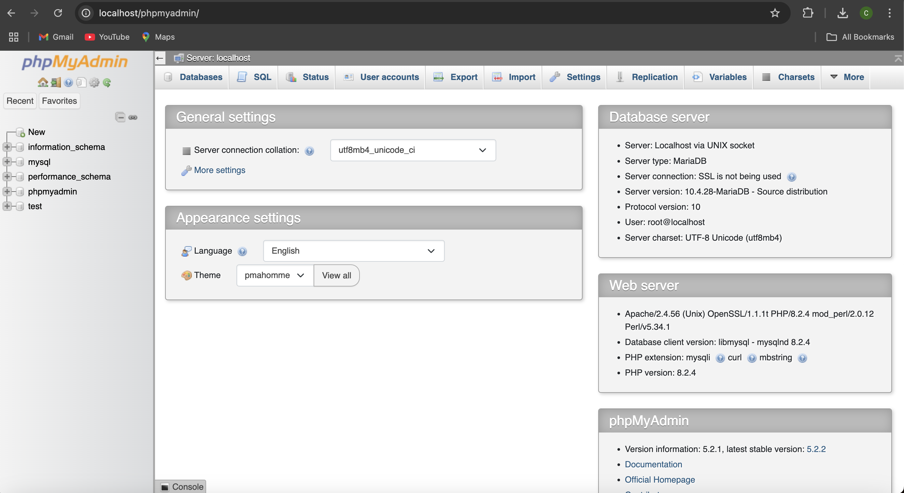

# COMP333-Landing-Page

We would like to use one of our four late days for this assignment. The web app that can be accessed by https://comp333.free.nf/landing_page.html was created by Carlos Munoz and Frankilin Mindich. The work was split 40% Carlos and 60% Franklin. Our webapp can be found using the link given. After creating the two tables below with the commands given in the screenshots, you must upload the following files to htdocs. Our app has a sign up feature, where once you sign up, you are logged in and can begin to write movie reviews. These reviews can be updated, read, and deleted when you are logged in as you follow the hyperlinks. There is also a logout function throughout the process.  

copyrightnotice.html  
form.html  
landing_page.html  
learnmore.html  
map.html  
style_sheet.css  

dbconnection.php (must be changed to localhost, root, etc, to be ran locally)  
deleteop.php  
deletereview.php  
logout.php  
main.php  
readreview.php  
review.php  
signup_functional.php  
signup.php  
update.php  
updatereview.php  
verifyLogin.php  
writereview.php  

Queries to create SQL tables:

PHPmyAdmin for Franklin
users:
CREATE TABLE users( username VARCHAR(255) PRIMARY KEY, password VARCHAR(255) );

reviews:
CREATE TABLE reviews( id int(10) PRIMARY KEY AUTO_INCREMENT, username VARCHAR(255), movie VARCHAR(255), rating int(10), review VARCHAR(255) );

PHPmyAdmin for Carlos 

# The following information pertains to Homework 1

This landing page was created by Carlos Munoz and Franklin Mindich as part of an excercise for the Software Engineering course at Wesleyan University. The work between the group was split 50/50. 

The file landing_page.html contains the html for the main page defined in the project. We decided to make the landing page for a streaming website specifically dedicated to nature/animal movies. 

It can be previewed at:
https://carlosm306.github.io/COMP333-Landing-Page/landing_page.html 

The file style_sheet.css defines the style for all pages in the directory. The twelve webp images are used as sample movie posters on the home page. The image whose title begins with "earth" is used in the page contained in the iframe, map.html, which is a placeholder for an interactive map. We imagined that could be a good use for an iframe in this context because it would have promotional value for the site, but would use an application that might be external to it. The repo also includes a copyright notice, a placeholder for a signup page, and a placeholder for a "learn more" page, all of which can be reached through hyperlinks in the landing page. Aside from that, the repo contains this "read me" and a license. 
